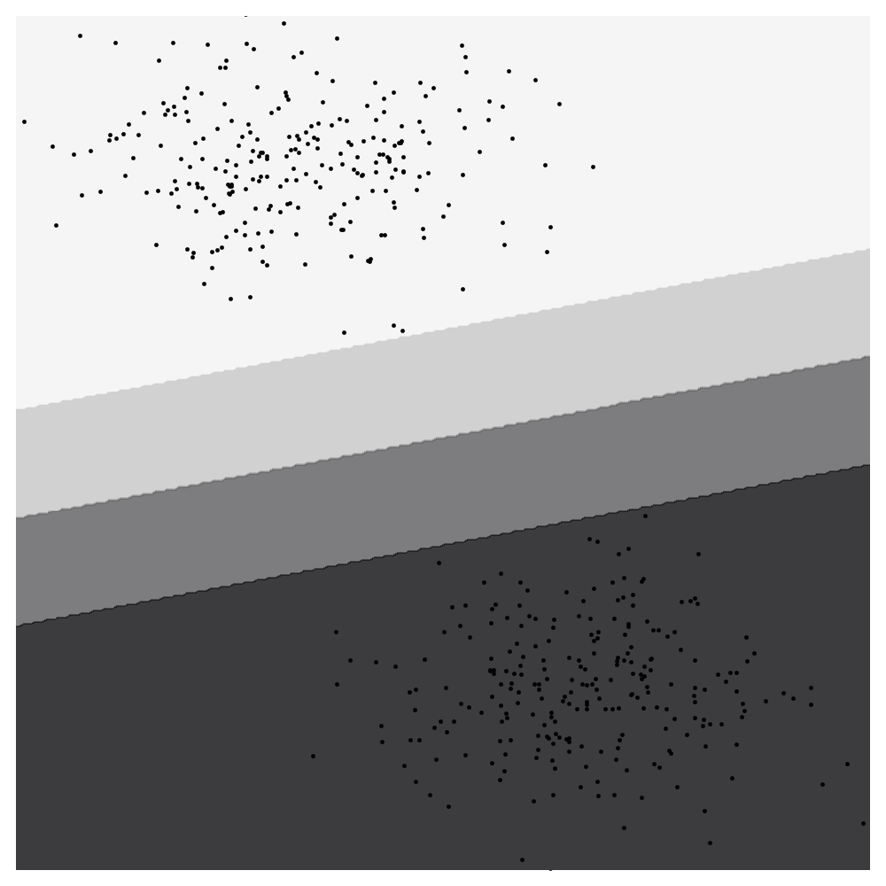
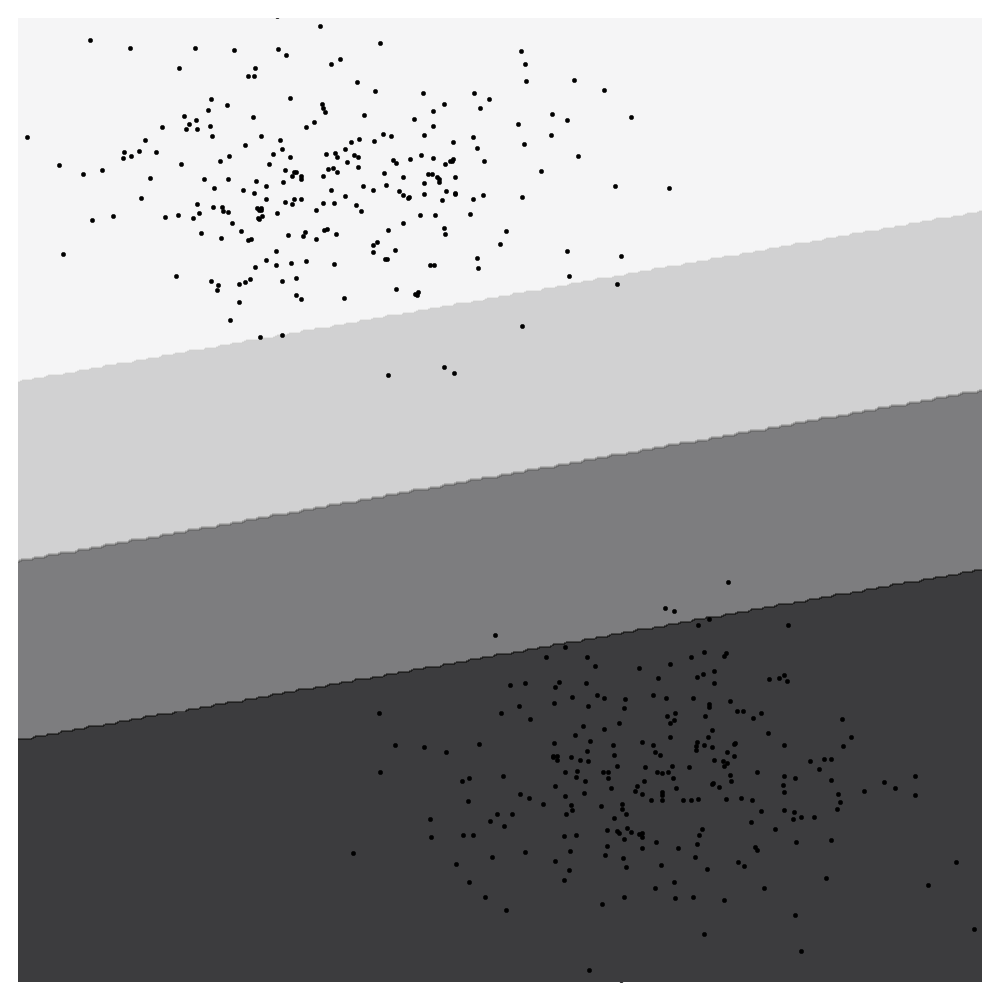

# Support Vector Machines

* Support Vector Machines (SVMs) with Linear Kernel
* Stochastic Gradient Descent (SGD)

## Requirements

```
$ pip install matplotlib numpy scikit-learn
$ pip install "torch>=0.4.0"
```

## Example

```sh
python main.py --c 0.01 --batchsize 1
```

| Hard margin<br>c = 0, batchsize = 1 | Soft margin<br>c = 0.01, batchsize = 1 |
| :---------------------------------: | :------------------------------------: |
|           |              |